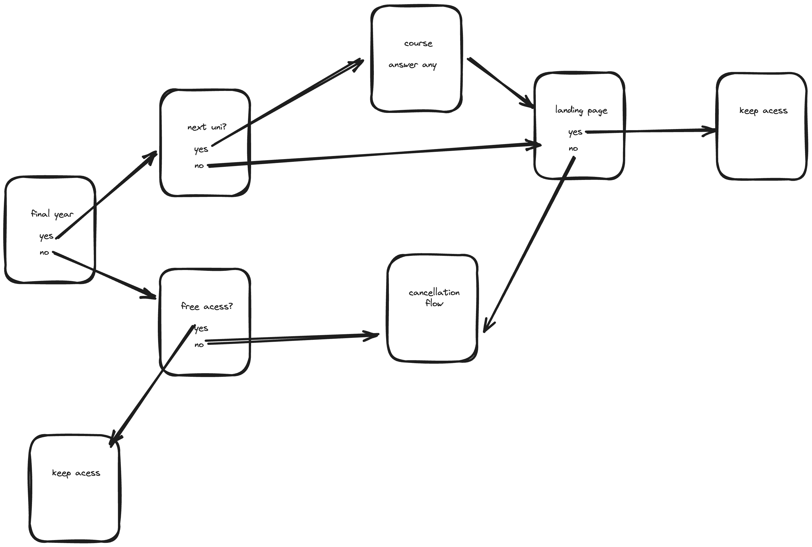

This project is built using NextJS, and uses Radix UI for the UI components.

## Getting Started

Clone the repo, cd into the folder and run following command to install dependencies:

```bash
pnpm
```

To start the development server, run:

```bash
pnpm dev
```

### Flow visualized



### What can be improved

The assignment was to be done in a short time in under 4 hours but it took me more than that, like around 6-7hrs. So It is not complete as per the requirements.

Here are the things that should be done to improve the project:

- Make reusable components: Currently the header and footer is repeated in all the pages, so it should be made as a component and used in all the pages.

- Make use of route groups to group related groups together. instead of nesting routes in a recursive manner, we can also look into adding a simple global state using jotai and managing the quiz app in a single page instead of multiple pages.

- Icons are missing in the quiz buttons, some of the CTA's are mising in the landing page.
